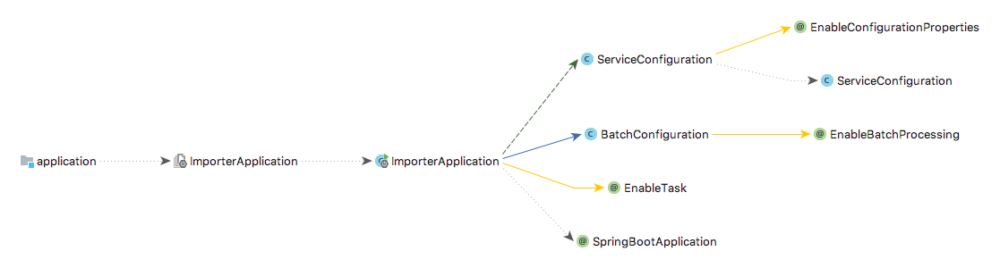
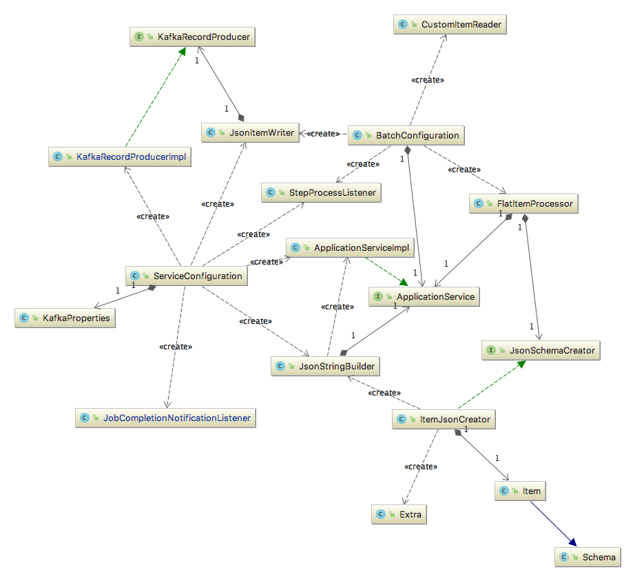

# Extensible Data Import Framework

**Authoriship**

|Version|Date|Modified by|Summary of changes|
|-------|----|-----------|------------------|
|  0.1  | 2017-07-20 | Rohullah, Jawid | initial version |
|  0.1a | 2017-07-21 | Rohullah, Jawid | framework description |
|  0.1b | 2017-07-22 | Rohullah, Jawid | evaluations, features, improvements, values parts |
| 0.2  | 2017-07-26 | Andres | Proofread: spelling, readability, etc.
| 0.2a | 2017-07-28 | Andres | Further refinement of text
| 0.3 | 2017-07-28 | Rohullah, Jawid | framework structure explanations + diagrams

The Open Data Platform which we have built for extracting, transforming and loading open sensor data is made up several significant components to efficiently process the large quantity of incoming data.

The first part of the system requires a powerful tool to do the job of importing very large amounts of different kinds of data with various formats and types from several data sources in a performant manner.

The job of the importers, in addition to fetching data from its source, is mainly to apply a series of rules and transformations to the source data in order to fit the our schema and be stored in the system.

For this purpose, a framework that supports the entire processes of extracting and transforming data is desirable.

In addition to the main import functionality, additional requirements and criteria were considered regarding the framework.

This chapter describes the requirements, selection criteria, design decisions, evaluations, technical implementation details, further possible improvements, as well as the value of having such a framework.

## Framework Requirements

The following are use-cases which our framework should cover:

  * user can add a new data source with minimal  coding and configuration effort.
  * provide various functionalities to the user such as processing data into customized format/schema
  * reusable components for reading, processing and writing data.
  * ideally the framework may be provided as a starter application which doesn't require it be built from scratch every time.
  * the framework should support extracting data from known transport channels and in known formats.
  * the entire framework must be based on microservices architecture (as opposed to a monolithic system).
  * the framework should include logging functionalities.
  * if an importer were to crash while importing data, it should continue from the point where it failed after being restarted.

## Evaluation of different data import frameworks

According to the framework requirements, we needed to search and find a useful and powerful tool such as an existing ETL framework or a technology on top of which we could build our data import framework. Therefore, it seemed to be a good idea to compare these frameworks and come up with the best decision. So we compared a couple of existing frameworks and technologies with different aspects such as:

- Functional and non-functional aspects of different frameworks are considered.
- Popularity of its programming language
- Popularity of its user community
- Open source or open license
- Capable of being deployed as a microservice to the Cloud
- Capable of scheduling the jobs
- Processing of jobs into batches
- Recoverability of individual jobs from failures  

### Evaluated Existing Frameworks

1. Spring Batch
    - Spring Cloud Tasks
    - Spring Cloud Data Flow
2. Java EE
3. Easy Batch
4. Summer Batch
5. Talend ETL

## Design Decisions

After evaluation and comparison, it was decided to implement our extensible framework using **Spring Batch** given the features and functionality it offers.

### Why Spring Batch

  - Lightweight, ready-to-use framework for robust batch processing
  - Suitable framework for data integration and processing
  - Popular with a large community of users
  - Written in a popular language (Java)
  - Its *Cloud Task* feature allows the deployment of data importers as microservices
  - Capabilities for scheduling the jobs in data processing pipeline
  - Familiarity to some team members

### Spring Batch Features

1. Reusable architecture framework
2. Lightweight, enterprise and batch job processing
3. Open Source
4. Reusable functions such as:
    - logging/tracing
    - job processing statistics
    - job restart
    - transaction management
5. Concurrent batch processing: parallel processing of a job
6. Manual or scheduled restart after failure
7. Deployment model, with the architecture JARs, built using Maven.
8. The ability to stop/start/restart jobs and maintain state between executions.

## Framework Structure/ Architecture

**Figure 1.** shows an abstract overview of a simple importer application. We will look at each component individually.

   - **ImporterApplication:** Entry point of the importer (Java main class).
   - **BatchConfiguration:** Includes configurations on how to read, process and write items. It also includes listeners, batch jobs and job steps.
   - **Listeners:** Are defined for tracking jobs and steps and logging the process of importing to the console.
   - **Jobs:** Generally there is one batch job for each importer. A batch job may have one or more steps for importing a single source.
        - **Steps:** Each step includes a reader, processor, and a writer.
          - **Reader:** Defines how to read items from the source.
          - **Processor:** Processes every item - an item is basically an object that represents an record - individually and creates a JSON string for that according to our defined schema  
          - **Writer:** Simply writes to Kafka queue.
   - `@SpringBootApplication`: Annotation to make the application a Spring Boot Application
   - `@EnableBatchProcessing`: Annotation to add the functionality of processing batch jobs.
   - `@EnableTask`: Enables the deployment of data importers as microservices which shutdown once importing is finished.
   - **ServiceConfiguration:** Is the component where the services are registered as Java Beans for re-usability. It is included in module 'library' where re-usable classes across all importers are defined. The following main components are included in the 'library' module.
        - **ServiceConfiguration**
        - **ApplicationService:** Includes some generally used methods to bring facility to importing.
        - **JsonItemWriter:** Asks `KafkaRecordProducer` to write individual JSON objects to Kafka queue
        - **KafkaRecordProducer:** Is the class where the items are written to Kafka queue

**Figure 2.** shows a more detailed view of classes inside a simple flat file importer and how they are related together.

## Framework Features

 - Ability to import data with various types and formats
 - A Module with pre-packaged utility classes
    - Just import and ready to use utility classes
 - Independent Cloud Tasks as microservices
 - Logging and tracing execution of jobs in different steps

## Framework Strengths

  - Usability
    - Reusable, ready-to-use functionalities
  - Extensibility
    - Ability to add custom utilities
    - Easy to add new jobs
  - Portability
    - Jobs run as microservices
    - Every importer could be packed into JAR file and deployed into private or public cloud

## Supported Data Formats

The sources which we used have come in various types and formats. Therefore different data formats and types have been implemented for importing through our framework such as:
  - REST Interface, HTTP and FTP data source types
  - Delimiter-separated value (DSV)
    - CSV
    - TSV
  - HTML
  - XLS
  - XLXS

## Possible Further Improvements

1. Scheduling jobs for every importer within the Framework:
until now, the scheduling of importing jobs is done by Kubernetes, but this functionality could be provided by Spring via an embeddable component such as (Quartz). This feature would easily allow the scheduling of jobs at specific times.
1. Recoverability of jobs from failures:
Currently the intermediate results of job processing are stored in an in-memory database (H2) inside the importer. As we containerized every importer into Docker containers, this functionality will disappear when the container terminates. The solution would be to create and configure a single relational database to store all the intermediary results of the jobs executions; whenever an importer crashes and is restarted, it will start from the last point that it stopped.     

## The Values of the Framework

* The application of our already built framework is mostly required for huge data integration and migration.
* Useful functionalities are ready to use just by importing them.
* It is very easy to extend it by adding new data sources to import and some new functions such as unit conversions.
* Writing transformed data to the pipeline (i.e. the queue) is abstracted away from the user and provided by the framework.
* Well defined, clean code with clear comments.
