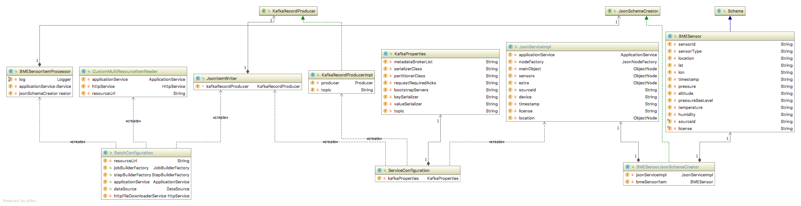

|Version|Date|Modified by|Summary of changes|
|-------|----|-----------|------------------|
|  0.1  | 2017-07-20 | Rohullah, Jawid | initial version |
|  0.1a  | 2017-07-21 | Rohullah, Jawid | framework description |
|  0.1b  | 2017-07-22 | Rohullah, Jawid | evaluations, features, improvements, values parts |

# Extensible Data Import Framework
The Open Data Platform which we have built for extracting, transforming and loading open sensor data is made up several significant system components to perform this huge amount of workloads.  
The first part of this system would require a powerful tool to do the job of importing vast amount of different kinds of data with various formats and types almost in real-time from several data sources. We called it data importer.  
We have needed our importer to apply some series of rules and functions to the imported data in order to load it to the target.  
Therefore a framework that preferably provides the whole processes of extracting and transforming data has been required.  
Beside these main importing functionalities, there were some requirements and criteria which we went through to apply them all in our framework.  
This chapter will walk you through all the requirements, criteria, design decisions, evaluations, technical implementation details, further possible improvements and the value of having such a framework.

## Framework Requirements
To cover all the main processes of importing data by our framework, we needed to add additional functions and features in order to serve for our own purposes.  
The followings are scenarios and use-cases which our framework should cover them:
  * user can add new data source to import data with minimal effort for coding and configurations.
  * providing various functionalities to the user like processing data into customized format/ schema
  * many reusable components for reading, processing and writing data
  * ideally the framework maybe provided as a starter application which doesn't require to build every time from the scratch.     
  * the framework should support to extract data in Well known format and types
  * the whole system framework must serves as a micro service not as a monolithic system.
  * the framework should include logging functionalities
  * reliability is a critical issue for every system, therefore if the importer fails in any point of processing data for importing; it should continue from the point it stopped after coming alive.
  * there maybe components to convert the units of specific measurement values into different metric units.

## Evaluation of different data import frameworks
According to the criteria described above, we needed to search and find a useful and powerful tool such as an already built framework or a technology which on top it we could easily build our data import framework. Therefore, it seemed to be a good idea to compare these frameworks and come up with the best decision. So we compared a couple of exiting frameworks and technologies with different aspects such as :

- Functional and non-functional aspects of different frameworks are considered.
- Popularity of its programming language
- Popularity of its user community
- to be open source or open license
- should be capable to deploy it as micro service in the Cloud
- capability of scheduling the jobs
- processing jobs into batches
- reliability of individual jobs from failures  

### Evaluated Existing Frameworks
1. Spring Batch
  - Spring Cloud Tasks
  - Spring Cloud Data flow
2. Java EE
3. Easy Batch
4. Summer Batch
5. Talend ETL

## Design Decisions
After evaluation and comparisons, it has been decided to implement our extensible framework using Spring Batch considering its features and functionalities.  

### Why Spring Batch
  - Lightweight, ready to use framework for robust batch processing
  - suitable framework for data integration and processing
  - popular with large community of users
  - with popular language (Java)
  - using its Cloud Task feature to build the system as micro service
  - capabilities for scheduling the jobs in data processing pipeline
  - familiarity of project members

### Spring Batch Features
1. Reusable architecture framework
2. lightweight, enterprise and batch job processing
3. Open Source
4. Reusable functions such as:
    - logging/tracing
    - job processing statistics
    - job restart
    - transaction management
5. Concurrent batch processing: parallel processing of a job
6. Manual or scheduled restart after failure
7. deployment model, with the architecture JARs, built using Maven.
8. The ability to stop/start/restart jobs and maintain state between executions.

## Framework Structure/ Architecture
   - BatchConfiguration
      - Batch jobs
        - Step
          - Reader
          - Processor: create json schema with received object  
          - Writer: write to queue
    - @SpringBootApplication
    - @EnableBatchProcessing
    - @EnableTask
    - Library (Module)
      - ServiceConfiguration: all services are registered as Beans for re-usability
        - ApplicationService
        - JsonItemWriter
        - KafkaRecordProducer
        

## Framework Features  
 - Ability to import data with various types and formates
 - Modules with pre-provided utility classes
    - Just import and ready to use utility classes
 - Independent Cloud Tasks as Micro services
 - Logging and tracing execution of jobs in different stages

## Framework Strengths
  - Usability
    - Reusable, ready to use functionalities
  - Extensibility
    - Ability to add custom utilities
    - Easy to add new jobs
  - Portability
    - jobs run as micro services
    - every importer could be packed into JAR file and deployment into private or public cloud

## Supported Data Formats
The sources which we used have come in various types and formates. Therefore different data formates and types have been implemented for importing through our framework such as:
  - REST Interface, http and ftp data source types
  - DSV
    - CSV
    - TSV
  - HTML
  - XLS
  - XLXS  
data formates which have been processed in a way that fits our requirements for our custom schema.

## Further Possible Improvements
1. Scheduling jobs for every importer within the Framework  
until now the Scheduling of importing jobs is done by Kubernetes on the cloud but we can improve and add this feature to our importing framework by using an embeddable component such as (Quartz). This feature would easily allow users to schedule the jobs in a customized time.  
2. reliability of jobs from failures  
Currently the intermediary results of jobs execution is stored in an In-memory database (H2) inside the importer. As we containerized every importer into Docker containers this functionality will disappear when the container terminated.  
The solution would be to create and configure a single relational database to store all the intermediary results of the jobs executions; whenever an importer crashed and restarted it will start from the last point that has been stopped.     
## The Values of the Framework
* The application of our already built framework is mostly required for huge data integration and migration.
* Useful functionalities are ready to use just by importing them.
* It is very easy extend it by adding new data source to import from and some new functions such as unit conversions.
* User doesn't need to rewrite the most functions such as writing data to the queue.  
* Well defined, clean codes with clear commenting
