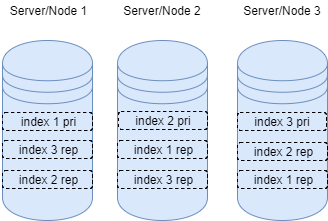
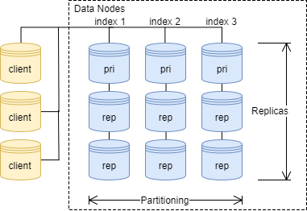
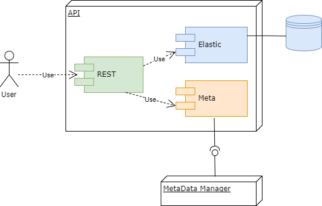

# Database

**Authoriship**

|Version|Date|Modified by|Summary of changes|
|-------|----|-----------|------------------|
|  0.9 | 2017-07-30 | Tasche, Nico | more architecture and mapping |
|  0.8 | 2017-07-30 | Tasche, Nico | elasticsearch architecture update |
|  0.7 | 2017-07-30 | Tasche, Nico | Data model and partitioning |
|  0.6 | 2017-07-30 | Tasche, Nico | Future work, more limitations and api |
|  0.5 | 2017-07-30 | Tasche, Nico | API |
|  0.4  | 2017-07-30 | Tasche, Nico | Overview and adjustments to the optic |
|  0.3  | 2017-07-30 | Tasche, Nico | survey and evaluation |
|  0.2  | 2017-07-28 | Tasche, Nico | changed to new structure |
|  0.1  | 2017-07-24 | Tasche, Nico | first working draft |


## Overview

The capitel is all about how the collected data is stored and the api to access the database. The main focus is going to be database, the requirement, decision making, architecture and data modell.
The API handles mainly the access to the database and implements some optimizations mentioned in the database articel.

## Requirements

### Primary Requirements

- scale-able in the range of petabyte in size
- hundred of thousands of requests per minute
- high availablility
- partition tolerance
- fast to handle timeseries
- fast to handle geolocation data
- immediate consistency is NOT necessary

As seen in the requirements, a hugh focus was on scalability. We had some secondary reqirements as well, which were mainly regarding our possibilities to handle the project.

### Secondary Requirements

- Open source or at the very least an open license is required.
- must be well documented
- must be manageable regarding administration and learning afford


## Survey of Existing Solutions

Based on our knowlage, any relational database as main datastorage has been quickly disreagarded. Fairly bad scaling behavior with the amount of data we have to handly and the fixed dataschema architecture were not a good fit for our usecase. That does not mean, that a relational database might be used for some special requirements.

Based on the knowlage in the group we had a closer look at Elastic Search and checked it against our requirements. This first look was very promising, but more on that in the next chapter.

Other sollutions in the realm of NoSQL databases were mainly web research. That included what is out there and what is the strength and weeknesses of each solution. That included mainly the big known ones like Cassandra, MangoDB, ...

The survey of other existing NoSQL database solutions was not very extensive, regarding real tests and in deep research. Because of the feedback, which suggested we use the wrong database, we decided in the middle of the project, to have an extra look at Apache Cassandra. 

## Evaluation Criteria & Decision-making Process

The process of deciding what database architecture to use we started with our requirements.

Besides the previously mentioned requirements we had some soft-requirements as well:
1. spread of database system
2. liveliness regarding
3. what was already known in the group

### Why Elastic Search

Checking our requirements Elastic Search fulfilled all of them. The reasons why we decided to use Elastic Search even before we went to deep into other databases were as follows:
- native support for geo spatial searches (see https://www.elastic.co/blog/lucene-points-6.0)
- group members allready knew Elastic Search, unlike all other NoSQL databases
- extremely well documented
- very high development pace from the company who develops it

Considering we had no real database expert in our team, the fact that group members already had practical experience with Slastic Search was a very important point for us.

### Special look at Cassandra

After a few tests and an overview of the documentation, it was clear that cassandra had two shortcommings reagarding our project.
1. The documentation seams to have quite a few gabs. (see http://cassandra.apache.org/doc/latest/architecture/overview.html and http://cassandra.apache.org/doc/latest/architecture/dynamo.html)
2. there is no native support for spatial geo data
## Implementation Details Database

### Intro to Elasticsearch

Elasticsearch is an opensource Lucene based search engine. It is under active development, with an extensive documentation.

### Architecture

Elastic Search is a document store and works with indicies, which are comparable to tables in the classic SQL world. Each index holds JSON based document which follow a mapping. The mapping is flexibel and can be extended however you want, but as soon as a field in the document has a mapping, all documents with the same field have to follow that mapping. E.g. if a document has a field called location, which is mapped to a geopoint data type. Every document with a field name location, has to have a geopoint in it.


Each index can be sharded and each node/server-instance can have multiple indieces. To better distribute search requests, the workload is divided among all shards belonging to an index and means that each shard holds just one part of an index. Because that would not scale very well and would have no partition tolerance,
each index has a configurable number of replicas. A new search request is send to one replica of each shard.

Elastic Search automaticly handels the distribution of search requests to the primary shards or replicas. Depending on the number nodes in a Elastic Search cluster, the engine also automaticly distributes the shards and replicas to the different nodes, all acording to the configuration made for each index. To illustrate that see the following figure, which assumes that the cluster holds three indicies, on three nodes, with two replicas per index.



The index configuration in our architecture follows a template, which is automatically applied to each new index we create:

```JSON
{

"template": "data-*",
"order": 1,
"settings": {
  "number_of_shards": 1,
  "number_of_replicas": 3
},
"mappings": {
  "_default_": {
    "_all": {
      "enabled": false
    }
  },
  "data": {
    "properties": {
      "device": {
        "type": "keyword"
      },
      "location": {
        "type": "geo_point"
      },
      "timestamp": {
        "type": "date"
      },
      "timestamp_record": {
        "type": "date"
      },
      "license": {
        "type": "text"
      }
    }
  }
}         
```

provides the number of shard, replicas and the basic mapping for our data model. If necessary this information can be overwritten before a new index is created. This is all the necessary information needed for our architecture and can not be changed after an index is created, except for the number of replicas, which can be increased.

### Data model

We decided to have an data model which is data-source-centric with the extra posibility to partition the data over time.
That means, each data source gets it own index with its own timeframe and its own adjusted datastructure.
All our data sources save a few basic data point with each element stored in the database, in particular are those:
- timestamp: when has the datapoint been recorded
- location: where has the datapoint been recorded

Those are acutally the only information we need to store, besides the individual measurements. We do acutally store some more information,
but regarding the common usecases for searches those two datapoints are enough for environemental data. For each data entry then, there are one ore many messurement in that datapoint. Each measurement than has a quality indicator, a observed value and an sensor name. Please refer to the full data-model in the project wiki for more information.

There were mainly two reasons to use this data model. For one it keeps the data provenance, which we quite like to keep. The second reason is that it is nice to handle in terms of partitioning.

### Partitioning

As for the question how does the used data model scale and how to best partition the imported data we decided for an 2-dimensional approach. One dimension is already covert by the data-source centric data model, which allows us, to partitioning by by source. The second dimens is the time. Each data source is partitioned based on the time a messurement has been taken and the granularity can be adjusted as well.

This gives us multiple advantages:

- it allows us to adjust the server infrastructe based on the data source
- it scales indefinitely
- index size is deterministic, cause of time based partitioning

So why does it scale so good? When importing data from one source, I process and store the data points in one index. This index is not just limited to the data source,
it is also limited to the time, e.g. 2016. That means, when 2016 is finished with importing data, the index is done and can be closed up, no one needs to care about it anymore.
After the index is done, it might even be transfered to another Elasticsearch node with different hardware.
That would be usefull, for example, when the average density of the smurf population is beeing stored.
The index can be transferd to a less powerfull hardware with fewer CPU cores and spinning harddrives and even fewer replicas,
because this information is probably hardly requested, except from Gargamel and maybe some surf protection groups.

As a starting point we choose to configure each index as shown in the figure below. We decided to keep each index on one shard, which lowers the network traffic and because we are very flexibel regarding the size of the index thanks to our timebased partitioning, this should not become a problem later on. To allow thousands of request per second, we decided to start with three replicas, so each request is forwarded to a different  replica. This can be flexible in- or decreased later on.



### Query optimization

Why do we need query optimization? For that I'm going to give a small small example to consider:
1. we import multiple sources, with multiple messurements: source1(airtemperature, watertemperatur) 1980-2017, source2(airtemperature) 1983-1990, source3(uv-index) 2009-2017
2. each source is partitioned by year and source 1 is partitioned by month for all data after 2015.
3. every index is naivly sharded over 3 nodes

Let's make a simple search request: give me all uv values data from 2015 till 2017 and aggregate an everage over the month.
Because the user does not now anything about the internal database architecture (at least he should not) he requests the temperature and the timeframe.

**Worst case:**

A search request in send to all indieces, that means:
```
source1 = 35 years + (2years x 12 month) x 3 shards
source1 = 177 shards

source2 = 17 years x 3 shars
source2 = 51 shards

source3 = 8 years x 3 shars
source3 = 8 years x 3 shars

source1 + source2 + source3 = 252 shards
```
So in worst case each shard has its own node(very unlikely), the search request has to be send to 252 nodes/computers.

**First optimization, Limit the time**

With a naive approach by checking the common time part of the request 2016-2017 and limit the indieces search with the following pattern:
```
indexsearch: *-201*
```
```
source1 = 5 years + (2years x 12 month) x 3 shards
source1 = 87 shards

source2 = 0 years x 3 shars
source2 = 0 shards

source3 = 3 years x 3 shars
source3 = 9 shards

source1 + source2 + source3 = 96 shards
```
We allready reduced the number of shards we need to address by 61%

With a little more sophisticated timelimitation algorithm, we could acctually do more and search just those two years:
```
indexsearch: *-2016, *-2017
```
```
source1 = 1 years + (2years x 12 month) x 3 shards
source1 = 75 shards

source2 = 0 shards

source3 = 2 years x 3 shars
source3 = 6 shards

source1 + source2 + source3 = 81 shards
```
Now we are at 68% reduction.

**Second optimization, Limit to indieces which contain the right data**

If we store in a seperate database, which data source and therefore indiece actually holds the requested data we can do even much more:
```
indexsearch: source3-2016, source3-2017
```
```
source1 = 0
source2 = 0 shards
source3 = 2 years x 3 shars = 6 shards

source1 + source2 + source3 = 6 shards
```
By using those two optimitzations, we were able to reduce the number of requeseted shard to 6, which means a total reduction of 96.2%.

This was just a naive example. In reality the reduction should even be much higher, with a growing number of data sources.
Let's say we have allready 100 data sources and we can limit a request to just two of those for example because the requested messuremnt it
provided just by those two, the saving of network traffic and workload would be immense.

## Implementation Details API

### Overview

As for the API it was important for us to provide a solution which is easy to scale via a loadbalancing, for example with an nginx instace as an entry point for the user of our system. That means, those instances need to be stateless. For that and because it is basicly a standard we use a REST interface to provide access to our data-collection.

### Architecture and Technology

As base technology we use nodejs, which is is easy to use JavaScript runtime based on Chrome's V8 JavaScript engine. It allows a fast interation pace and needs just minimal preparation to develop server instances with.



The API implementation consists of three parts.
1. Route: defines all routes and parses all parameters to be used in our system
2. Meta: connects to the management database and requests all necessary data (this part is prepared, but connection actually not implemented yet)
3. elastic: does everything Elastic Search specific and could actually be replaced by an other database connection if the database would be replaced for example.

### REST APIs

The REST API currently constists of three End Points:

**1. GET /api/sources/**

Returns all currently available resources

**2. GET /api/sources/:indexName**

Returns data based on the sources they came from

**3. GET /api/measurements/:measurements**

Returns data based on the messurements you're requesting

The 2nd as well as the 3rd REST-endpoint allow a more specific search, based on extra parameters.

**Parameters:**

|Parameter|Example|Description|
|-------|----|-----------|
|  time  | 2011,2017-06-22T165:37:12:100 | start and exluding endtime which is to be considert as two comma seperated values | 
|  location  | 52.5239,13.4573,53.5239,16.4573 | squere location to consider with lat/lon upper left and lat/lon bottum right | 
|  bucket | 1w | defines bucketing to consider with timeframe this might be 2w for bucketing into two weeks buckets, or 1m for 1 minute buckets |
|  agg  | sum or avg | aggregate messurement with sum or average |
|  mess  | airtemperature | defines the messurement you want to consider for aggregation and bucketing(not for /api/measurements Endpoint) |

## Critical Analysis/Limitations

### Joins

One mayor drawback of elasticsearch is the missing possibility of server side join, the way they are known by SQL based database-system.
This means, any kind of join operation has to be done either on a seperate server, like our api instance, or on the application side.
This is actually something we were not really aware of for a long time.

### Administration

This is probably not really Elastic Search specific but should be mentioned in this chapter as well. To setup this the basic database is quite easy, but to scale it to up to petabyte needs quite a bit consideration. Our data model and the current implemented optimizations will help scale the database and everything should work without any performance drawbacks for quite a while. To archive this, lots of working though documention and local requesttesting had to be done. As said before, this is probably for every other database as well.

### Testing

Testing is something we could just do on a very limited scale. Unfortunately, any possible short-commings in our architecture would just show much later then we could test.

## Future Development and Enhancements

### Data Postprocessing

As mentioned in the Limitations section, joins are not possible in our system right now. One way of doing it would be to allow application based or backend based join, which will have same limitations. A better way would be to post process our data at low usage times.
One idea would be to collect all the data for a defined area and put all information we have about that area into one dataset. The area could be for example a size of 100m x 100m.
This would allow for very fast, very complex queries, which invole quite a few messurements.

### The API

To be honest, the current implementation of the API is quite limited. This is mainly due to time limitations while implementing.
There are the points, which should be implemented
1. Allowinig to make post requests to make more complex queries. That would for example include the transfer of big geospatial shapes for filtering.
2. Adding security with API tokens
3. Adding full access to the management database
