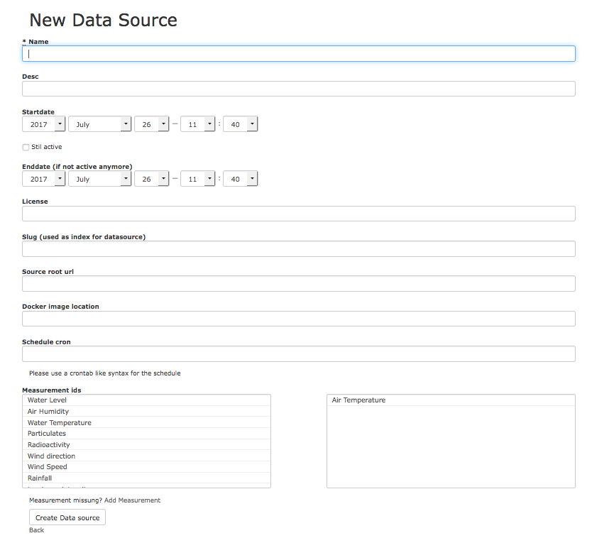
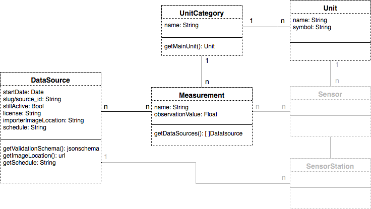
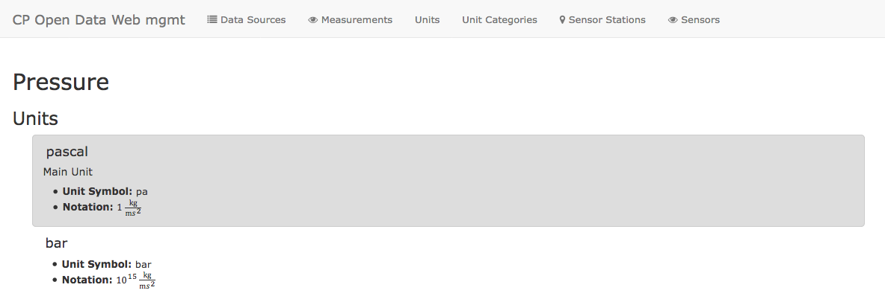

# Relational Web Management Platform
Written by Paul Wille


We decided to have a separate system component to manage the metadata of data-sources that shall be imported and that already have been or are ongoingly imported. This system shall fulfill several tasks that are important for organizing the importing/ETL-process. Furthermore it provides imortant information to several other system components. 

In this chapter we will discuss why we decided to include such a system, what it was build for and how we achieved this. 


## Purpose of the System

This main purposes of the system are: 

* The user registering and describing a datasources that is going to be imported
* Providing this metadata information regarding the datasources to other system-components 
* Provide users that want to import data with information about units
* Enabling visitors or users, that want to use the data that exists (and not import new data), to see the listed resources our system contains

### Registering Sources
To each datasource there is important information and metadata that must be known to our system before importing the datasource. This information 

* must be known upfront
* does only contain metainformation about the sources
* has no direct relation to actual measurement-data
* is quite static and does not change over time. 

Therefore we chose not to manage it in the same database as the saved extracted and transformed datapoints of the sensor-data-sources, but have a separate system. With this we can tweak the data-storage component for providing and fullfilling its main tasks and do not mix up meta-information and actual sensordata in one place.

Meta-Information that has to be provided to our system prior to importing for several reasons are mainly:

* Name of source
* The startdate, from which on the source provides data
* if the source is still active (data is being appended to the source in the future). 
  * If not so: the end date of measurements
* Under what license the data is published

Additionally we ask the user to give additional information, that is useful for our system

* If the datasource is still active: At what schedule is new data published
* A *slug* that can be used as an id within our pipeline and in ElasticSearch
* Which measurements the data source provides (which actual measurements the data-source collects)
* The location of the docker container as URL


### Provide information to other system-components

#### Provide Validation Schema
As described in the chapter about validation and inserting to ElasticSearch we have a distinct component, seperated from the importers, that will handle the validation of the outcome of those. This schema has to be provided. The actual schema itself is fixed and could be hardcoded to the validator, without need to make another http-request. 

Because of two reasons we decided that this would be a bad idea:

* In order to validate that datasource-dependent information in the outcome is correct as well, there are dynamic contents within the validation schema (mostly the id of the data source to prevent insertion with the wrong id)
* If the schema changes over time, correcting information hardcoded within the validator would need a complete redeploy and change of the validator as such

Therefore we needed a place where said validation-schema can reside. The web management system seemed to be the right pace for that, as it caries metainformation about datasources anyways and the datasources are registered there. So it is easy to provide the relevant information aswell. The management system provides an api call to supply the validation schema to the validators that looks like this:

```
GET /data_sources/:id/getValidationSchema
```
The Response looks like this. The const `source_id` thereby will be replaced by the ID of the data source

```
{
  "$schema": "http://json-schema.org/schema#",
  "title": "Data Source",
  "description": "A Data Source for Open Sensor Data from the CP project at TU Berlin. ",
  "type": "object",
  "properties": {
    "source_id": {"const": "source_slug"},
    "device": {"type": "string"},
    "timestamp": { "type": "string", "format": "date-time" },
    "timestamp_data": { "type": "string", "format": "date-time" },
    "location": {
      "type": "object",
      "properties": {
        "lat": {"type": "number",
                "exclusiveMaximum": true,
                "exclusiveMinimum": true,
                "maximum": 90,
                "minimum": -90
               },
        "lon": {"type": "number",
                "exclusiveMaximum": true,
                "exclusiveMinimum": true,
                "maximum": 180,
                "minimum": -180,
               }
      },
    "required": ["lat", "lon"]
    },
    "license": {"type": "string"},
    "sensors": {
      "type": "object",
      "items": [
      {
        "type": "object",
        "properties": {
          "sensor": {"type": "string"},
          "observation_type": {"type": "string"},
          "observation_value": {"type": "number"}
        }
      }]
    }
  },
  "required": ["source_id", "timestamp","sensors", "location", "license"]
}
```


#### Provide Information to Elastic Search API for query optimization

Like desdcribed in the section about our data model and Elasticsearch as a data-storage-component our data-model is datasource-based and not measurement based. For certain types of queries that tackle measurements it will though be important to have further information on the connection between data sources and measurements.

As there where several possibilities where this information could be stored and managed and how it would be provided, the easiest to start with was in our opinion, that the implementer of an importer provides this information to us, when registering his datasource. The user therefore has to mark what measurements a datasource contains upfront. (// TODO ref figure new data source)

In order to optimize querying our data this information is provided to the API that wraps the search interface of Elasticsearch via an API itself. The information is stored in an indexed join table that holds this n-to-n mapping between measurements and datasources. As you can see in the class diagram (//TODO ref figure) of the relational system, queries in both directions are provided: getting all measurements, a datasource provides and getting all datasources that contain a given measurement. The corresponding rout	es look like this:

```
GET /data_sources/:id/measurements
```
An example request would look like following:

```
GET /data_sources/blume_messnetz/measurements

[
	{"id":1,"name":"Air Temperature","desc":"","unit_category_id":"temperature"},
	{"id":3,"name":"Air Humidity","desc":"amount of water vapor present in the air","unit_category_id":"humidity"}
]
```


```
GET /measurements/:id/data_sources
```
An example request would look like following

```
GET /measurements/1/data_sources

[
	{"id":1,"slug":"blume_messnetz","license":""},
	{"id":5,"slug":"german_weather_service","license":""}
]
```


#### Provide configuration information to the importer-deployment-component
As the registering should be at best the only step, in which the implementer has to provide information to our system besides providing the importer itself it should preferably cover all information needed to get an importer running. 

## Requirements

In contrast to nearly every other system component we had to build, the management platform had to meet not as many criteria that one would expect from a distributed cloud-system in general. Most of the data the system will contain is quite static data and the number of requests that we expect is also quite low. 

* Availability to other system components, that require the held information 
* Quick response time (for qury-optimization within the public search-API)
* Ability to run asynchronous background tasks (for scheduling)

While those requirements look like those of a cloud-system, taking a closer look exposed, that a good caching solution would be sufficient in our case. If the system would grow bigger it would stil require to be scaled in some way. But as the information in the managament database will change very slowly we decided, that this could be achieved by prepending a distributed caching system, like for example using *Redis* for that. By that we would achieve quick response times and availability, as *Redis* can be distributed and read accesses are very fast and possible on all nodes. Writing is quite expensive due to the replication method used by Redis but it would be sufficient to updte the cache several times a day with new information from the management-database, so we considered this a shortfall, we could take. 

## Architectural Details

The system was built using *RubyOnRails* with *PostgreSQL* as a database. The reasons why we chose to use RubyOnRails are:

* Relatively fast developement of an MVC-Web-application
* RoR is established for over a decade, has therefore lots of resources - also for all kinds of extensions
* Extensive community support
* Very good integrated ORM adapters, that could easily be exchanged for e.g. ODM adapters for e.g. mongodb
* Offers the dynamic of Ruby as programming language

As mentioned before, the planning of the extent of the functionalitly offered by this system, was very vague. Besides managing metadata and providing an API for other components, further features were at least considered to be part of this system, like for example a scheduler that triggers the component that handles the deploy of importers. Therefore we chose to build this system on top of an infrastructure, that can be easily extended in many directions and has nice to use database adapters instead of a more lightweight system. 

While initially we also wanted to model a data source with its sensors grouped in sensor stations, this approach would bring imense overhead for configuring datasources in our system upfront, as a user would have to very exactly model a data source with all its sensors and sensor stations first. For big services like e.g. the German Weather Servide this would be an enormous amount of work. Gathering this information would better be done by scraping the information present in Elasticsearch and translating them to geolocated information for all sensors/sensor-stations/datasources. In {//TODO ref figure} you can see the modeling for this approach greyed out. 

The main metainformation about the datasources (besides metadata about the source itself) that we still needed within our system (the locality of the sensor and the grouping of sensor stations is not essential for our system to work) and had to offer to the user registering a source were then: 

* Information about the measurements a datasource offers data for
* Information what unit we use for a measurement as main unit (see section Unit system // TODO ref section)



### Future Improvements

#### Exchange Scheduling information
Due to not reaching every goal of our initial plan on how the architecture should look like, the scheduler had to move to the component managing the deploy on a Kubernetes cluster. While this component should be resposible for deploying importers for a datasource aswell in the future, the information about the schedule should actually be provided to the web management system by the user. This is currently not happening. There would be several ways how to manage scheduling and/or deliver the scheduling information from this system to the component handling the scheduling.

* Having a background-processing component that acts as a scheduler withing the web management platform. This would require an API to trigger the deploy on the component responsible for that, which we were not able to achieve. 
* Having a microservice-like component, that is only responsible for scheduling and triggering importers to be deployed. This would aswell require an API on the deploying-component.
* Leaving the scheduling within the deploying-component. This would also require an API in it, but just for receiving the genereal schedule, not for offering a hook to trigger an import.

The second option seems more granular and more conform to our general microservice-approach but would also require the most configuration and deployment effort. Including a scheduler in the web management platform would somehow violate this approach but still make sense, as this component could easily be integrated within RubyOnRails and would be a standalone component within it. 

#### Caching
There is currently no caching-solution, as the workloads during the developement phase were quite manageable Also including a distributed caching system in our production pipeline seemed to be too high effort and would take up many resources, that would actually not be needed. Therefore we wanted to use the limeted and expensive resources we had for actual importing. Extending the System itself to use caching with Redis would be very easy achievable though.

## Unit System
When it comes to gather and manage sensor data one topic that directly comes to mind is that of units. Uncountable units exist and while there are international systems like the *International System of Units (SI)* or the *metric system* it is hard to find one system, that fits all possible measurements in our case. Some of the reasons for that are:

* Not for all measurements there exists an standardized unit in unit systems (e.g. parts per million)
* While standardized systems have the advantage of offering *one* standard unit for a category, those do not have to be intuitive (e.g. using Kelvin for outside temperature probably will not be intuitive for many people)

Because of that we had to think of an own way, how units would be chosen, managed and how users would get information about them. 

### Further requirements
Deciding on a strategy to model units, was a quite long process and not all requirements could be fullfilled. In this section we will discuss the most important requirements to later on explain for what approach we 

1. Allow convertability and ability to localize
1. It has to be understandable, in what unit a measurement is expressed and in which it was measured
It is absolutely avoidable that measurements exist in the database, with a not understandable unit or even worse with a unit that differs from what the system supposes the measurement is expressed in. It is therefore advisable to enfoce the user to handle units carefully
1. Each unit should only exist once. Typos, different exprsssions etc. shall not lead to confusion

### Implementation
With the requirements in mind we decided to organize units like so:

1. We introduced **Unit Categories**. Units themselves always belong to a unit category. The unit-category desribes an entity for which measurements exist, which express their observations with one of the units of that category (See figure for Class Diagram // TODO ref figure).
2. Each unit has a **main unit** that we decide on. By calling the api or visiting the management platform a user can see, which the main unit is. Within our datastore we only use the main unit of a unit-category for expressing measurements.
3. Units are managed by admins repectively users with permit to do so. 
4. We therefore have a curated list of the unit-categories and units
5. If there are units, measurements or even categories missing, each user can propose new ones. This proposals are also managed by the group of people managing the units.

Measurements are controlled on the platform itself to allow users to better propose new measurements, as this may happen more often. Units and the Unit categories however are managed in a *.yml* file. The syntax we used looks like following for one entry:

```
From config/constants/units.yml:

pascal:
  id: pressure_pascal
  name: "pascal"
  unit_symbol: "pa"
  unit_category_id: pressure
  notation: "1 <centerdot>
              <mfrac>
                <mrow>
                  kg
                </mrow>
                <mrow>
                  m 
                  <msup>
                          <mi>s</mi>
                          <mn>2</mn>
                </mrow>
              </mfrac>"
              
From config/constants/unit_categories.yml:

pressure:
  id: pressure
  name: Pressure

```
The unit categories are pretty straight forward. For a unit there are some more possibilities. Besides declaring the unit symbol, the category it belongs to, its name you are allowed to use MathML to express what the meaning of a unit is. This is especially helpful with units that can be directly converted to each other. // TODO ref picture




The API of the web management system also provides calls to a) receive the main unit of a unit category and to b) get a list of all units there are for a unit category. Both of these information are of course aswell accessible from the frontend of the system. 

```
GET /unit_categories/:id/getMainUnit
```
Example request:

```
GET /unit_categories/temperature/getMainUnit

{
	"id":"temperature_celsius",
	"name":"celsius",
	"unit_category_id":"temperature",
	"unit_symbol":"°C"
}
```

```
GET /unit_categories/:id/units
```
Example request:

```
GET /unit_categories/temperature/units

[
	{"attributes"
		{"id":"temperature_celsius","name":"celsius","unit_symbol":"°C","unit_category_id":"temperature","notation":""}},
	{"attributes":
		{"id":"temperature_fahrenheit","name":"fahrenheit","unit_symbol":"°F","unit_category_id":"temperature","notation":""}},
	{"attributes":
		{"id":"temperature_kelvin","name":"kelvin","unit_symbol":"K","unit_category_id":"temperature","notation":""}}
	[...]
]
```

### Discussion of our approach
This implementation has some advantages but also some disadvantages. In this section we want to take a closer look to both sides.

As we force the user to use our main unit, we can be sure, that all data in the database is of the same unit for a measurent type. Of course we cannot enforce, that the user does convert his measurements or does it right, but this counts as a faulty import, which is the responsibility of the user anyways. Of course an assessment if data is legit would be nice, but this is also hard to achieve and not in the scope of our project. 

Our approach of having a curated list of course means some management overhead and possible waittimes for the user, if something is not present yet. But to us this seemed like the only way in order to prevent doublings of units/measurements etc. and a chaos with the unis. 

As the unit categories should be present after a short testing phase of a system, and a main unit exists with with, as the curators decide on one, the user should most of the time be able to register a source, when he wants to, as he only needs to know the main unit.

A big advantage of our approach is, that we kind of crowd-source the implementation of converters by this, as it happens during the ETL phase while importing (See //TODO ref chapter unit conversion) a source. This gives us a chance to achieve the following:

* Conversions can be retraced, as it is known, which converter a user used
* Localization within our database can easily be done, as all measurements of a unit category have the same unit and converters are written the moment someone has to convert his source data to our preferred unit.
* By corwd-sourcing the implementation of converteres they are also open sourced for reuse by other users. Having our own converters only in the system to convert measurements after they are in the database would not guarantee the reusability as importers and our database frontend depend on totally different things. 