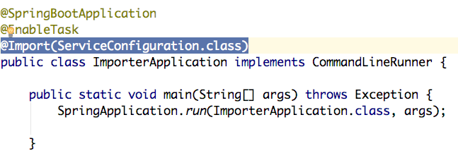

# How to Write a Data Importer

**Authoriship**

|Version|Date|Modified by|Summary of changes|
|-------|----|-----------|------------------|
|0.1    | 2017-07-29 | Jawid, Rohullah | Initial version|


This chapter guides you through building your own importer on top of an already existing template.

## Template

Instead of wrting a long manual on how to write an importer we provide you with starter apps (templates) that you can start to customize right away.

## Pre-requisites

We assume that you are:

 - comfortable working with Java and Spring Boot
 - already familiar working with Spring Batch
 - having knowledge of working with multi module applications using maven and Spring Boot.

If you need a quick start guide of Spring Batch you can find it [here:](https://projects.spring.io/spring-batch/)


## How to Proceed

1. Download or copy the template that fits your needs.

#### Template Modules

The template is a multi module application which includes two modules:

 - application
 - library

These modules are defined inside `pom.xml` file.

```dep
<modules>
        <module>library</module>
        <module>application</module>
</modules>
```

2. Start by changing the importer name inside pom.xml in the root directory of the project. You don't need to change anything else inside pom.xml.


```dep
<groupId>de.tu_berlin.ise.open_data</groupId>
    <artifactId>your-importer-name-here</artifactId>
    <version>0.1.0</version>
    <packaging>pom</packaging>
```


3. Once you finished editing `pom.xml` you can open it as a project using your IDE. Now you can start to customize it.
4. Before changing anything else you can see how the importer works by running a kafka server locally and starting the importer's main class using your IDE.

    OR

    Inside the root directory of the importer run these commands:

       $ cd application
       $ mvn spring-boot:run

5. You can now see inside the console how a simple job runs.


### Things to know about the template:
- Inside the `pom.xml` in the 'application' module the following dependency is used to include the 'library' module:

```dependency
<dependency>
    <groupId>de.tu_berlin.ise.open_data.library</groupId>
    <artifactId>library</artifactId>
    <version>0.0.1-SNAPSHOT</version>
</dependency>
```

- Registered beans inside the library module could be autowired by importing the 'ServiceConfiguration' class from package 'de.tu_berlin.ise.open_data.library'. You can see how it is imported in main class:

 <br>

You can now start to edit the template.
