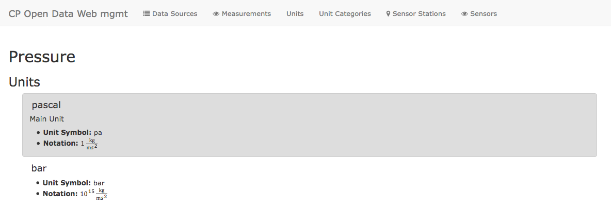

# Units of Measurement

**Authorship**

| Version | Date | Modified by | Summary of changes |
|---------|------|-------------|--------------------|
| 0.1     | 2017-07-19 | Paul   | First draft |
| &mdash; | 2017-07-29 | Andres | Moved text from §8 |
| 1.0     | 2014-07-30 | Andres | Rewrite |


Since the same physical quantity can be represented in different units of measurement (both meters and miles represent lengths, for example), storing measurements of physical quantities inherently introduces the complexity of these different representations. The topic is certainly quite interesting, especially when considering how sensors process and convert signals to digital values for a measurement, but we shall limit the scope of our discussion here to how our system deals with the different ways in which the same physical quantity can be represented, and to the facilities provided to users by the system to convert their measurements from one unit to another.


## Requirements

From early on in the analysis phase, it became clear that in order to deal with the heterogeneity of incoming data and to have any chance of providing a uniform way to query the data, a global schema would have to be introduced and to which all imported data would have to conform. That is, someone who is performing a query would expect the data to be consistent, even if it came from different sources. Say our platform offers air temperature readings; this data may come from different sensors manufactured by different companies and which provide data in different formats. In order for the data to be usable for analysis, I would not expect to have to convert data from the U.S. to Celsius in order to be able to compare it with data from Europe, or from degrees Kelvin if a particular sensor manufacturer has calibrated its devices to report ambient temperature in using this unit.

Having standard units for a given physical quantity means that we must also provide facilities to data importers to convert from their unit to that required by our system.

With this in mind, we formalized our requirements with respect to units as follows:

* all measurement values stored and reported by our system must be accompanied by a unit of measurement
* provide extensible facilities to users to convert units within their importer packages to the required unit defined by the system for that physical quantity

## Survey of Previous Work

### Standards

**ISO**

ISO 1000 &ndash; *"SI units and recommendations for the use of their multiples and of certain other units"* was first introduced in 1981 and revised in 1992, but withdrawn and superseded by ISO(/DIN) 80000 in 2009. The standard is under the ISO/TC 12 technical committee, which is responsible for

> Standardization of units and symbols for quantities and units (and mathematical symbols) used within the different fields of science and technology, giving, where necessary, definitions of these quantities and units. Standard conversion factors between the various units.

In addition, now-withdrawn ISO 2955:1983 *"Information processing -- Representation of SI and other units in systems with limited character sets"* deals with encoding unit symbols for machine processing.

 Unfortunately, ISO standards are not available free of charge, so their relevance and usefulness to our project could not be evaluated.


**ANSI X3.50**

The 1986 standard *"Representations for U.S. Customary, SI, and Other Units to Be Used in Systems with Limited Character Sets"* deals with the symbolic representation of the units, and as a result is not of particular interest to our objectives, namely:

> This standard was not designed for [...] usage by humans as input to, or output from, data systems. [...] They should never be printed out for publication or for other forms of public information transfer.


**NIST 811**

The *Guide for the Use of the International System of Units (SI)* from 1995 and updated in 2008 provides a comprehensive reference regarding SI and units in general aimed to assist scientific paper authors from the National Institute of Standards and Technology (NIST). The guide proved useful in condensing the wealth of information that is SI and the variety of units and formats in an straight forward, complete yet concise document.


**Unified Code for Units of Measure (UCUM)**

Based on ISO 80000, UCUM's "purpose is to facilitate unambiguous electronic communication of quantities together with their units."  Like ISO 2955 and ANSI X3.50, its focus is on machine-to-machine communication and encoding of units. Unlike the latter two standards, which it claims contain numerous name conflicts and are incomplete, UCUM "provides a single coding system for units that is complete, free of all ambiguities, and that assigns to each defined unit a concise semantics."

The standard is in scope and of (limited) interest to our application


### Applications

**GNU Units**

String-based command-line application for converting units. Available as Linux and Windows binaries.


**jScience**

This library is, among others, an implementation of the UCUM standard mentioned prior. The library was part of a Java Specification Request (JSR) to be made part of the Java Standard Library under JSR-275, which was rejected in 2010.

The project itself is not in active development and can no longer be downloaded from their main site, as the source code and binaries were hosted in the now-defunct java.net platform.

**JSR-363 &ndash; Units of Measurement API**

Based on jScience (JSR-275), this library provides a rich programming interface to express quantities and units in Java. The proposal is on its way to being approved at the time of writing (July, 2017).

### Conclusions

The Units of Measurement API (JSR-363) is promising. However, given the fact that many such libraries have failed to gain traction in the past, and because we want to keep the learning curve for enthusiast data importers low, we consider this API to bee too complex for the simple task at hand: to convert units.


## Implementation

First we consider the `Serializable` Java interface. In serialization, the goal is to transform an in-memory object into a format which enables its state to be persisted, and conversely to re-create an object from this persisted state to an in-memory object again. To accomplish this, the interface requires one method to serialize the object, and one to deserialize, respectively. Additionally, because the serialization implementation may have changed between the time an object was serialized and when it will be deserialized, the interface imposes a version descriptor (simply a `long` value).

Our task is quite similar to serialization, not in that we seek to persist an object (which has attributes with values), but rather in that there is some process which renders a particular instance of a "thing" into a different *representation*; plus, it's also able to reverse this process. Versioning is naturally also of our interest, since without some revertibility mechanism would render measurements converted with a faulty unit converter useless.


<hr/>

Uncountable units exist and while there are international systems like the *International System of Units (SI)* or the *metric system* it is hard to find one system, that fits all possible measurements in our case. Some of the reasons for that are:

* Not for all measurements there exists an standardized unit in unit systems (e.g. parts per million)
* While standardized systems have the advantage of offering *one* standard unit for a category, those do not have to be intuitive (e.g. using Kelvin for outside temperature probably will not be intuitive for many people)

Because of that we had to think of an own way, how units would be chosen, managed and how users would get information about them.


## Requirements

Deciding on a strategy to model units, was a quite long process and not all requirements could be fulfilled. In this section we will discuss the most important requirements to later on explain for what approach we

1. Allow convertibility and ability to localize
1. It has to be understandable, in what unit a measurement is expressed and in which it was measured
It is absolutely avoidable that measurements exist in the database, with a not understandable unit or even worse with a unit that differs from what the system supposes the measurement is expressed in. It is therefore advisable to enforce the user to handle units carefully
1. Each unit should only exist once. Typos, different expressions etc. shall not lead to confusion

## Implementation
With the requirements in mind we decided to organize units like so:

1. We introduced **Unit Categories**. Units themselves always belong to a unit category. The unit-category describes an entity for which measurements exist, which express their observations with one of the units of that category (See figure for Class Diagram // TODO ref figure).
2. Each unit has a **main unit** that we decide on. By calling the API or visiting the management platform a user can see, which the main unit is. Within our datastore we only use the main unit of a unit-category for expressing measurements.
3. Units are managed by admins receptively users with permit to do so.
4. We therefore have a curated list of the unit-categories and units
5. If there are units, measurements or even categories missing, each user can propose new ones. This proposals are also managed by the group of people managing the units.

Measurements are controlled on the platform itself to allow users to better propose new measurements, as this may happen more often. Units and the Unit categories however are managed in a *.yml* file. The syntax we used looks like following for one entry:

```
From config/constants/units.yml:

pascal:
  id: pressure_pascal
  name: "pascal"
  unit_symbol: "pa"
  unit_category_id: pressure
  notation: "1 <centerdot>
              <mfrac>
                <mrow>
                  kg
                </mrow>
                <mrow>
                  m
                  <msup>
                          <mi>s</mi>
                          <mn>2</mn>
                </mrow>
              </mfrac>"

From config/constants/unit_categories.yml:

pressure:
  id: pressure
  name: Pressure

```
The unit categories are pretty straightforward. For a unit there are some more possibilities. Besides declaring the unit symbol, the category it belongs to, its name you are allowed to use MathML to express what the meaning of a unit is. This is especially helpful with units that can be directly converted to each other. // TODO ref picture




The API of the web management system also provides calls to a) receive the main unit of a unit category and to b) get a list of all units there are for a unit category. Both of these information are of course aswell accessible from the frontend of the system.

```
GET /unit_categories/:id/getMainUnit
```
Example request:

```
GET /unit_categories/temperature/getMainUnit

{
	"id":"temperature_celsius",
	"name":"celsius",
	"unit_category_id":"temperature",
	"unit_symbol":"°C"
}
```

```
GET /unit_categories/:id/units
```
Example request:

```
GET /unit_categories/temperature/units

[
	{"attributes"
		{"id":"temperature_celsius","name":"celsius","unit_symbol":"°C","unit_category_id":"temperature","notation":""}},
	{"attributes":
		{"id":"temperature_fahrenheit","name":"fahrenheit","unit_symbol":"°F","unit_category_id":"temperature","notation":""}},
	{"attributes":
		{"id":"temperature_kelvin","name":"kelvin","unit_symbol":"K","unit_category_id":"temperature","notation":""}}
	[...]
]
```

## Discussion

This implementation has some advantages but also some disadvantages. In this section we want to take a closer look to both sides.

As we force the user to use our main unit, we can be sure, that all data in the database is of the same unit for a measurement type. Of course we cannot enforce that the user does convert measurements correctly or at all, but this would be considered as a faulty import, which in the end is the responsibility of the user. Of course an assessment of the correctness of data would be nice, but this is also hard to achieve and not within the scope of our project.

Our approach of having a curated list means some management overhead and possible longer implementation effort for the user if a unit conversion he or she needs is not yet available. Given the vast number of units in general and the lack of standardization in the way sensors report their data, giving a lot of latitude to the user to specify the units and the necessary conversions seems like the only reasonable way in which to approach the issue.

As the unit categories should be present after a short testing phase of a system, and a main unit exists with with, as the curators decide on one, the user should most of the time be able to register a source, when he wants to, as he only needs to know the main unit.

A big advantage of our approach is, that we kind of crowd-source the implementation of converters by this, as it happens during the ETL phase while importing (See //TODO ref chapter unit conversion) a source. This gives us a chance to achieve the following:

* Conversions can be reverted, as the converter used is stored with the data.
* Localization within our database can easily be done, as all measurements of a unit category have the same unit and converters are written the moment someone has to convert his source data to our preferred unit.
* By crowd-sourcing the implementation of converters they are also open sourced for reuse by other users. Having our own converters only in the system to convert measurements after they are in the database would not guarantee the reusability as importers and our database frontend depend on totally different things.
